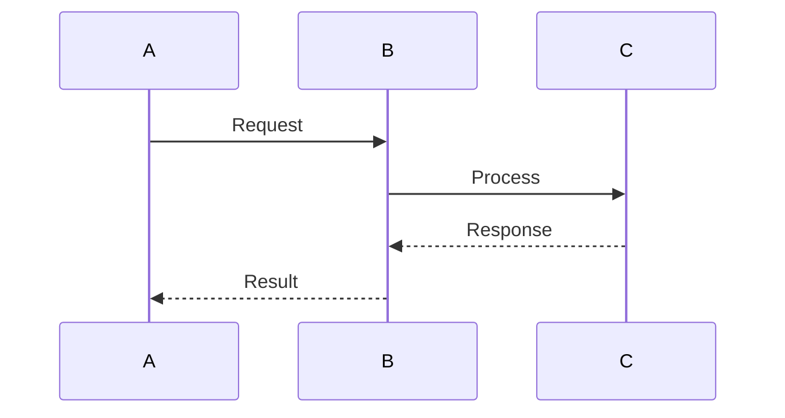

# Session: ARCHITECTURE

## Focus
- High-level system design
- Component relationships and interactions
- Separation of concerns
- Scalability and performance considerations
- Maintainability and extensibility

## Guidelines
- Ensure strict meta/implementation separation per §SEP protocol
- Consider distributed system challenges if applicable
- Plan for appropriate error handling and resilience
- Design for testability and maintainability
- Document architectural decisions and their rationales
- Consider deployment and operational aspects

## Approach
1. Understand requirements and constraints thoroughly
2. Define system boundaries and external interfaces
3. Identify key components and their responsibilities
4. Design component interactions and data flow
5. Consider non-functional requirements (performance, security, etc.)
6. Document architecture with diagrams and explanations

## Response Format
For architecture sessions:

```
## Architecture Design: [System/Feature Name]

### Requirements & Constraints
- Functional requirements
- Non-functional requirements
- System constraints

### Component Design
- Component 1: Responsibility, interfaces
- Component 2: Responsibility, interfaces
- ...

### Interaction Diagrams


### Data Models
- Model 1: Fields, relationships
- Model 2: Fields, relationships
- ...

### Key Design Decisions
- Decision 1: Options considered, rationale for choice
- Decision 2: Options considered, rationale for choice
- ...

### Implementation Considerations
- Points to consider during implementation
- Potential challenges
- Required technologies
```
